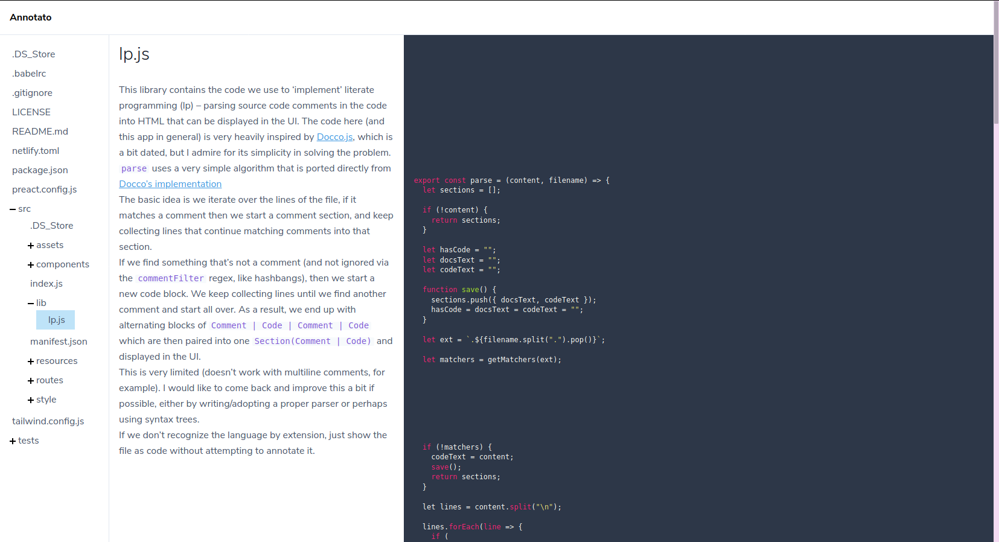

I finally released a new project --
[Annotato](https://annotato.nikbrendler.com)! It's a tool for reading source
code that has lots of comments, and was a collaboration with
[@hyper_yolo](https://twitter.com/hyper_yolo). This post explains why I wrote
the tool and the process.

## Motivation

One of the best ways to learn as a developer is to read code that others have
written, doubly so if they've taken the time to expound their work in a literate
style. Understanding code that you didn't write is a very valuable skill. This
tool attempts to help bridge that understanding gap, while also encouraging the
creation of purely expository comments that are designed to teach future readers
of the source code (or yourself, six months later).

Most code out there falls into one of these categories:
1. Very little to no comments. Great for simple programs or scripts with simple
   problems to solve.
2. Lots of focused comments that explain tricky or confusing bits, or attempt to
   document architectural decisions, e.g. "this will trigger when the input is
   null", or "I'm using this algorithm because I believe it performs best given
   these assumptions".
3. Thorough, well-written comments with lots of examples that are designed to be
   used for generated web documentation with tools like Javadoc.
4. Literate-style code. Long, wordy comments (or just prose intermingling with
   source code, if your tooling supports it) to explain theory- or
   math-heavy code, or just the logic of the programmer that wrote it.

In the case of (2), while these comments can be very helpful to someone who's
attempting to _change_ the code, much more can be said to someone who's
attempting to _learn_ from it. Code that falls in bucket (3) is often very
well-organized and not hard to follow for an experienced veteran, but most of
the comments are geared towards those who wish to _use_ the library or tool and
might not explain all the magic that makes it go.

This tool is to help _learn_ from code, so it fits most naturally with code
written in the style of (4). While a lot of the existing literate code out there
is academic, this can work for any kind of program as evidenced by the examples
below. Really, any tech blog or tutorial with lots of code examples could be
reimagined in this way!

## Inspiration

I've been reading a lot of code on the web lately while learning new stuff about
Rust and graphics programming. I often taken notes and sometimes go so far as to
pull down the code and annotate it myself in vim while trying to understand. I
found it tough to look through some of the Rust code that is very
well-documented, but designed for `rustdoc`.

Browsing on https://docs.rs, I was jumping between the source and the docs too
often. Looking at the source itself, the comments are just too long and
cumbersome to read when formatted to take advantage of the documentation
tooling. To help me with this first-world problem, I looked around for a tool
and didn't find much, so I started to work on one. Before I got too far,
[@hyper_yolo](https://twitter.com/hyper_yolo) told me about
[Docco](https://github.com/jashkenas/docco) and her positive experience with the
Backbone.js docs.

Docco was a big step in the right direction, docs and code side-by-side but it
was meant to be run as part of a build step and not for casually browsing. I
decided to make something similar that would work for me -- Annotato!

## Building it

[Preact](https://preactjs.com) has been on my list to try for a while and this
seemed like a good fit for it. So far it feels like everything I like about
React/Redux in a neat little package, so I will likely continue using it for new
JS projects.

I would say I put about 40 hours into it all told over the course of about a
month. React hooks were completely new to me and I had to rewrite all the
code interacting with the GitHub API about 3 times while I figured the best way
to work with the combination of declarative GraphQL hooks and fumbled through
an unfamiliar API.

Luckily [@hyper_yolo](https://twitter.com/hyper_yolo) was able to help me out
with design and styling or it probably would have taken about twice as long (and
looked half as good)!
