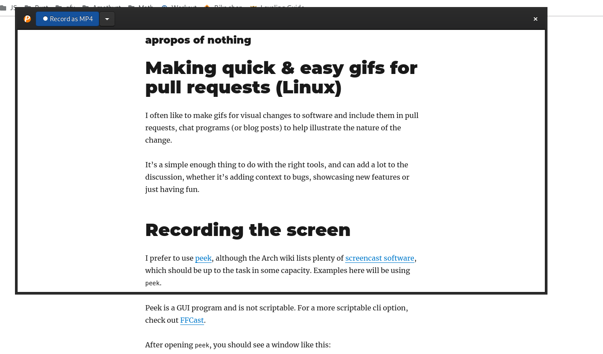
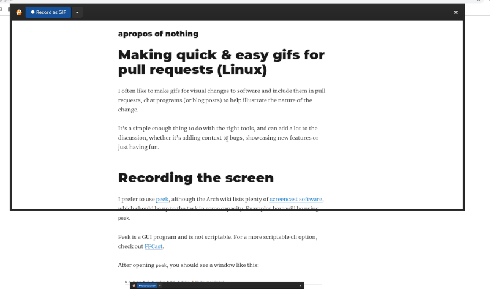
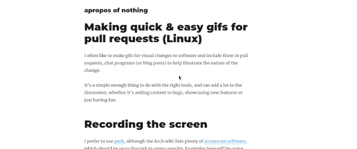

I often like to make gifs for visual changes to software and include them in
pull requests, chat programs (or blog posts) to help illustrate the nature of
the change.

It's a simple enough thing to do with the right tools, and can add a lot to the
discussion, whether it's adding context to bugs, showcasing new features or just
having fun.

# Recording the screen

I prefer to use [peek](https://github.com/phw/peek), although the Arch wiki
lists plenty of [screencast
software](https://wiki.archlinux.org/index.php/Screen_capture#Screencast_software),
which should be up to the task in some capacity. Examples here will be using
`peek`.

Peek is a GUI program and is not scriptable. For a more scriptable cli option,
check out [FFCast](https://github.com/lolilolicon/FFcast).

After opening `peek`, you should see a window like this:



You can resize the window and position it over the region of the screen you wish
to make a recording of, and hit the record button. When you're done, press the
button again to stop.

There's a few preferences that may be of interest:

* You can record as GIF, MP4, APNG, or WebM
* Hiding the mouse cursor in output.
* Set a keyboard shortcut to stop recording, so you don't see the cursor flying
  towards the stop button.
* Change the framerate. 10 FPS could be overkill for simple UI gifs.

# Processing the output

I used `peek` as is for a while, but recently got curious about how I can easily
make the output smaller without sacrificing too much fidelity of the image.
Recording a large enough screen with the default 10 FPS can result in some
pretty large files.

To edit or resize you can use [gifsicle](https://github.com/kohler/gifsicle). It
has a nice intuitive API and can make the gifs quite small.

```
# Resize so that the width is 800, '_' will vary the height depending on the
# aspect ratio
gifsicle --resize 800x_ my_gif.gif > my_gif_resized.gif
```

Note: If you're creating assets for the web, mp4 is preferable because it
[compresses better than
gif](https://dougsillars.com/2017/04/12/animated-gifs-vs-video-files/). So if
you record as mp4, you can resize using `ffmpeg` like this:

```
# Resizing an mp4 file to frame width 600, preserving aspect ratio
ffmpeg -i input.mp4 -vf scale=600:-1 output.mp4
```

# Example



The result!


