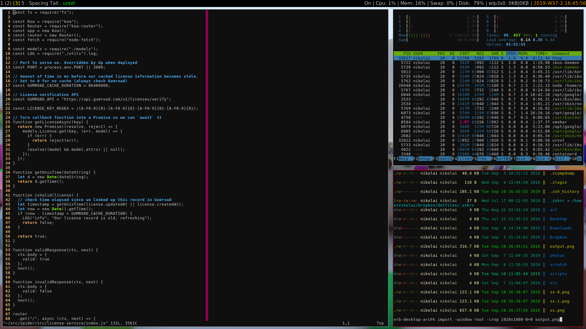
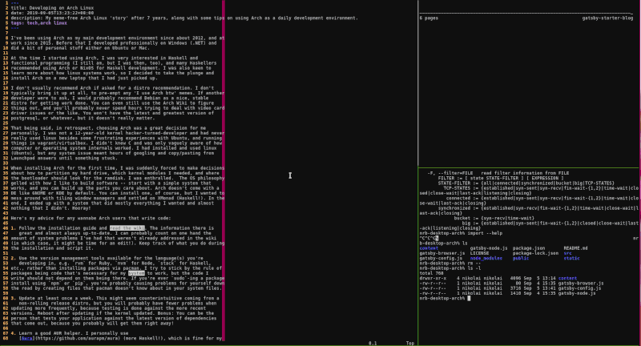

I've been using Arch as my main development environment since about 2012, and at
work since 2015. Before that I developed professionally on Windows (.NET) and
did a bit of personal stuff either on Ubuntu or Mac.

At the time I started using Arch, I was very interested in Haskell and
functional programming (I still am, but I was then, too), and many Haskellers
recommended using Arch or NixOS for Haskell development. I was also keen to
learn more about how linux systems work, so I decided to take the plunge and
install Arch on a new laptop that I had just picked up.

I don't usually recommend Arch if asked for a distro recommendation. If another
developer were to ask, I would probably recommend Debian as a nice, stable
distro for getting work done. You can still use the Arch wiki to figure things
out, and you'll probably never spend hours trying to deal with video card driver
issues or the like. You won't have the latest and greatest version of
postgres, or whatever, but it doesn't really matter.

That being said, in retrospect, choosing Arch was a great decision for me
personally. I _wanted_ to learn how to partition my disk properly, script out
parts of my system to my liking, and not install any bloated IDEs or GUI
programs, so it seemed like a good fit.  Arch doesn't come with a DE like GNOME
or KDE by default. You can install one, of course, but I wanted to mess around
with tiling window managers and settled on XMonad (Haskell!). In the end, I
ended up with a system that did mostly everything I wanted and almost nothing
that I didn't. Hooray!

Here's my advice for any wannabe Arch users that write code:

1. Follow the installation guide and *read the wiki*. The information there is
   great and almost always up-to-date. I can probably count on one hand the
amount of system problems I've had that weren't already addressed in the wiki
(in which case, it might be time for an edit!). Keep track of what you do during
the installation and script it.

2. Use the version management tools available for the language(s) you're
   developing in, e.g. `rvm` for Ruby, `nvm` for Node, `stack` for Haskell,
etc., rather than installing packages via pacman. I try to stick by the rule of
packages being code that's necessary for my _system_ to work, but the code I
write should not depend on them being there. If you're ever `sudo`-ing a package
install using `npm` or `pip`, you're probably causing problems for yourself down
the road by creating files that pacman doesn't know about in your system files.

3. Update at least once a week. This might seem counterintuitive coming from a
   non-rolling release distro, but you will probably have fewer problems when
updating more frequently, because testing is done against the more recent
versions. Reboot after updating if the kernel updated. Bonus: You can be the
person that tests your application against the latest version of dependencies
that come out, because you probably will get them right away!

4. Learn a good AUR helper. I personally use
   [Aura](https://github.com/aurapm/aura) (more Haskell!), which is fine for my
usage, but at the very least you should be able to download PKGBUILD files and
read them, and then install directly from the AUR. As a developer, I think it's
worthwhile learning about the [Arch Build
System](https://wiki.archlinux.org/index.php/Arch_Build_System) and make your
own packages, too... especially if there are other Arch users in your company
that can benefit from them! I've personally had to rebuild a few packages using
different compiler flags to make things work on my system, too, and the build
system makes that a piece of cake.

5. Encrypt your disk. I personally use LUKS on LVM as the wiki recommends during
   installation. This may already be a requirement for your development machine
depending on your employer, but I don't think there's any downside to using
full-disk encryption in 2019.

So, is this a Good Idea? I think so, but it depends how much work you're willing
to put in to your system, and whether you really want to learn some of the
details of how Linux works. If not, there's no shame in buying a Mac and
focusing more on your craft.
