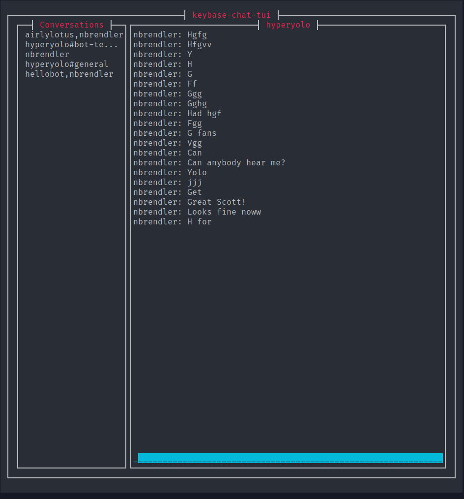

### [Annotato](https://annotato.nikbrendler.com)

A tool for viewing source code. More info about the how/why is in [the blog post](/annotato).

### [Keybase Terminal Chat Client](https://github.com/nbrendler/keybase-chat-tui)

A TUI (terminal user interface) program for using Keybase chat. Written in Rust.

### [AyyTeeGee](https://ayyteegee.nikbrendler.com)

An HTML 5 game written in Phaser 3/TypeScript.
