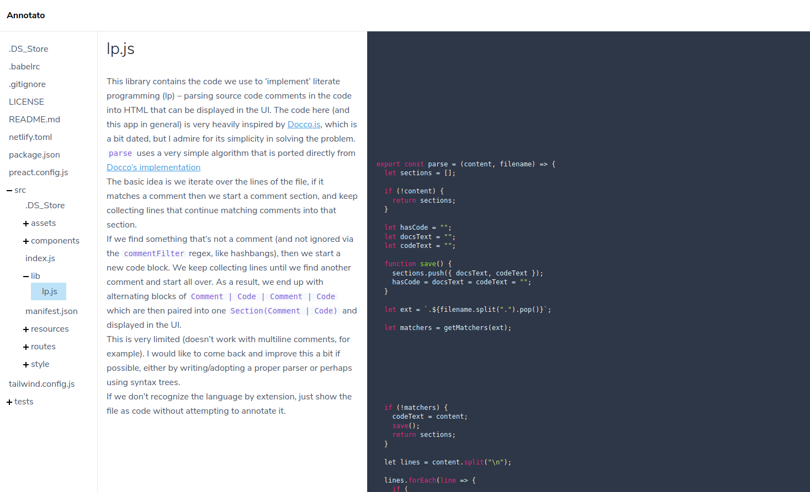
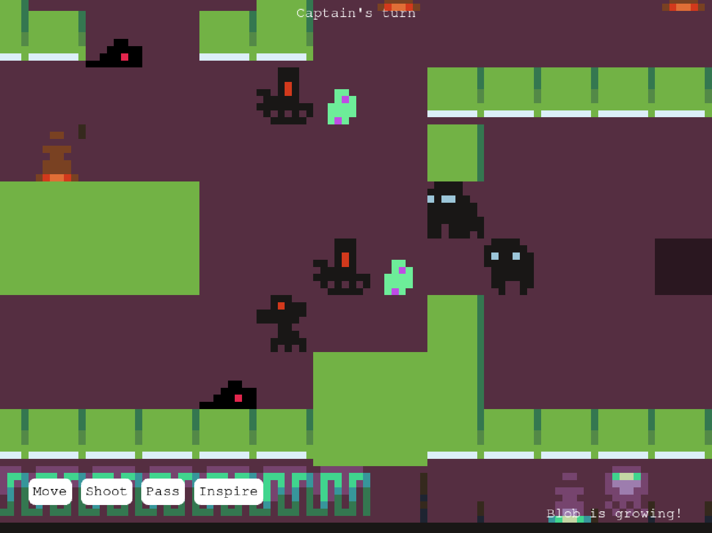

### [Annotato](https://annotato.nikbrendler.com)

A tool for viewing source code. More info about the how/why is in [the blog post](/annotato).

### [AyyTeeGee](https://ayyteegee.nikbrendler.com)

An HTML 5 game written in Phaser 3/TypeScript.
